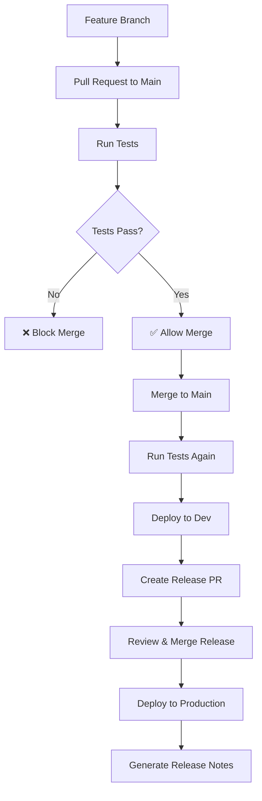

# Azure Pension Demo - CI/CD Pipeline

This project demonstrates a complete CI/CD pipeline for .NET 8 Azure Functions with automated testing, deployment, and release management.

## 🏗️ Project Structure

```
azure-pension-demo/
├── src/
│   ├── Functions/           # Azure Functions (.NET 8 Isolated)
│   ├── Application/         # Business logic layer
│   ├── Domain/             # Domain entities and interfaces
│   └── Tests/              # Unit tests (xUnit)
├── infra/                  # Terraform infrastructure code
├── .github/workflows/      # GitHub Actions CI/CD pipeline
└── tests/                  # Bruno API tests
```

## 🔮 Future Enhancements Planned

### **Database Integration**
- 🐳 **Docker Compose + Azure SQL Edge**: Spin up local database environments fast for development
- 🗃️ **EF Core Integration**: Create entities and SQL migrations efficiently using `dotnet ef` commands
  ```bash
  dotnet ef migrations add InitialCreate
  dotnet ef database update
  ```

### **Advanced Testing**
- 🧪 **Integration Tests**: TestContainers + NUnit with Docker test environments for database integration testing
- 🚀 **API Testing**: Bruno collections for comprehensive API endpoint testing (better than Postman for CI/CD)

### **Development Experience**
- 📦 **One-Command Setup**: `docker-compose up` for complete local development environment
- 🔄 **Hot Reload**: Database schema changes with automatic migration application
- 🐛 **Debugging**: Full-stack debugging with containerized dependencies

## 🚀 CI/CD Pipeline Overview

Our pipeline implements a **GitFlow-inspired** approach with automated deployments and releases:

### Pipeline Flow



## 📋 Detailed CI/CD Steps

### 1. **Pull Request Workflow**
When you create a PR from a feature branch to `main`:

- **Trigger**: Pull request opened/updated
- **Jobs**: `test` only
- **Actions**:
  1. 🔄 Checkout code
  2. ⚙️ Setup .NET 8.0.x
  3. 📦 Restore dependencies (`PensionDemo.sln`)
  4. 🔨 Build entire solution
  5. 🧪 Run unit tests with code coverage
- **Result**: PR can only be merged if tests pass ✅

### 2. **Development Deployment**
When you merge a PR to `main` (non-release):

- **Trigger**: Push to `main` branch (excluding release commits)
- **Jobs**: `test` → `deploy-dev` → `release-please`
- **Actions**:
  1. 🧪 **Test Job**: Same as PR workflow
  2. 🚀 **Deploy to Dev**:
     - Setup .NET 8.0.x
     - Build Functions project only
     - Publish Azure Functions package
     - Deploy to Azure Functions Dev environment
  3. 📋 **Release Management**:
     - Run release-please to analyze commits
     - Create release PR if changes warrant a release
     - Follow conventional commit standards

### 3. **Production Deployment**
When you merge a release PR to `main`:

- **Trigger**: Push to `main` with release commit message
- **Jobs**: `test` → `deploy-prod`
- **Actions**:
  1. 🧪 **Test Job**: Ensure quality before production
  2. 🎯 **Deploy to Production**:
     - Build and publish Functions
     - Deploy to Azure Functions Production
     - Clean up release branch automatically
  3. 📝 **Release Notes**: Auto-generated by release-please

## 🔧 Technical Implementation

### Test Strategy
- **Solution-Level Testing**: Builds and tests the entire `PensionDemo.sln`
- **Unit Tests**: Located in `src/Tests/` project
- **Code Coverage**: Collected using XPlat Code Coverage
- **Deployment Testing**: Only Functions project is built for deployment

### Environment Configuration
- **Dev Environment**: Automatic deployment on main merge
- **Prod Environment**: Manual release workflow via release PRs
- **Secrets**: Azure publish profiles stored in GitHub secrets
  - `AZURE_FUNCTIONAPP_PUBLISH_PROFILE_DEV`
  - `AZURE_FUNCTIONAPP_PUBLISH_PROFILE_PROD`

### Release Management
- **Tool**: Google Release Please (modern `googleapis/release-please-action@v4`)
- **Versioning**: Semantic versioning based on conventional commits
- **Changelog**: Auto-generated with categorized changes
- **Branch Cleanup**: Automatic deletion of release branches after merge

## 🛡️ Safety Features

### Quality Gates
- ✅ **Tests must pass** before any deployment
- ✅ **Dev deployment must succeed** before creating releases
- ✅ **No production deployment** if tests fail
- ✅ **Release branches cleaned up** automatically

### Deployment Protection
- 🔒 **Environment Protection**: GitHub environments with approval rules
- 🔄 **Rollback Capability**: Previous versions remain available
- 📊 **Monitoring**: Deploy status visible in GitHub Actions
- 🚫 **Fail-Safe**: Deployments halt on any failure

## 📚 Conventional Commits

Use these commit types for automatic release categorization:

- `feat:` - New features (minor version bump)
- `fix:` - Bug fixes (patch version bump)  
- `chore:` - Maintenance tasks
- `docs:` - Documentation changes
- `style:` - Code formatting
- `refactor:` - Code restructuring
- `perf:` - Performance improvements
- `test:` - Test updates
- `build:` - Build system changes
- `ci:` - CI/CD changes

### Breaking Changes
Add `!` after type or include `BREAKING CHANGE:` in footer for major version bumps:
```
feat!: redesign user authentication
```

## 🎮 Demo Scenarios

### Scenario 1: Feature Development
```bash
# 1. Create feature branch
git checkout -b feature/add-pension-calculation

# 2. Make changes, commit with conventional format
git commit -m "feat: add pension calculation endpoint"

# 3. Push and create PR
git push origin feature/add-pension-calculation
# Create PR on GitHub → Tests run automatically

# 4. Merge PR → Auto-deploy to dev + create release PR
```

### Scenario 2: Production Release
```bash
# 1. Review and merge the auto-created release PR
# 2. Automatic production deployment triggers
# 3. Release notes generated automatically
# 4. Release branch cleaned up
```

## 🔍 Monitoring & Troubleshooting

### Pipeline Status
- **GitHub Actions**: View real-time pipeline status
- **Environment Deployments**: Track dev/prod deployment history
- **Release History**: See all releases and their changelogs

### Common Issues
1. **Test Failures**: Check unit test output in GitHub Actions logs
2. **Deployment Failures**: Verify Azure publish profiles are valid
3. **Release PR Not Created**: Ensure conventional commit format is used
4. **Branch Cleanup**: Verify GitHub repo settings allow branch deletion

## 🚀 Getting Started

1. **Clone Repository**: `git clone <repo-url>`
2. **Install .NET 8**: Download from Microsoft
3. **Setup Azure**: Configure function apps and get publish profiles
4. **Configure Secrets**: Add publish profiles to GitHub repository secrets
5. **Enable Settings**: Turn on "Automatically delete head branches" in repo settings
6. **Start Developing**: Create feature branches and follow conventional commits

---

**This pipeline provides a production-ready CI/CD solution with automatic testing, deployment, and release management for Azure Functions applications.** 🎉

This project demonstrates a **modern CI/CD pipeline** for a C# Azure Functions app with automated testing, deployment, and release management.

## 🏗️ Architecture Overview
- **Azure Functions (C#)**: API endpoints for pension operations (.NET 8)
- **EF Core + Azure SQL**: Data persistence layer
- **Mediatr**: CQRS pattern for clean architecture
- **Terraform Cloud**: Infrastructure as Code (IaC)
- **GitHub Actions**: Automated CI/CD pipeline
- **Release-Please**: Automated semantic versioning and releases

## 🚀 CI/CD Pipeline Demo

### Pipeline Flow Visualization
```
Feature Branch → PR → Tests → Merge → Deploy Dev → Release PR → Deploy Prod
     ↓           ↓      ↓        ↓         ↓           ↓          ↓
   Code Dev   Run Tests Only  Auto Deploy  Create    Manual    Auto Deploy
                             to Dev Env   Release   Approval   to Prod Env
```

### Detailed Pipeline Steps

#### 1. **Pull Request Workflow**
**Trigger**: Opening PR from `feature/*` to `main`
```yaml
# What happens:
✅ Checkout code
✅ Setup .NET 8
✅ Restore dependencies  
✅ Build application
✅ Run unit tests
❌ NO deployment (testing only)
```

#### 2. **Development Deployment**
**Trigger**: Merging feature branch to `main` (non-release commits)
```yaml
# Sequential execution:
✅ Run all tests (must pass)
✅ Build for Release
✅ Deploy to Azure Functions Dev Environment
✅ Create Release PR (via release-please)
```

#### 3. **Production Deployment** 
**Trigger**: Merging release PR to `main` (release commits)
```yaml
# What happens:
✅ Run all tests (must pass)
✅ Build for Release  
✅ Deploy to Azure Functions Prod Environment
✅ Auto-delete release branch (cleanup)
✅ Generate release notes
```

## 🔧 Pipeline Configuration

### GitHub Secrets Required
```bash
# Azure Function App Publish Profiles
AZURE_FUNCTIONAPP_PUBLISH_PROFILE_DEV   # Dev environment
AZURE_FUNCTIONAPP_PUBLISH_PROFILE_PROD  # Production environment
```

### Environment Detection
The pipeline automatically detects deployment target:
- **Dev Deploy**: `!contains(commit.message, 'chore(main): release')`
- **Prod Deploy**: `contains(commit.message, 'chore(main): release')`

### Safety Features
- ✅ **Tests must pass** before any deployment
- ✅ **Dev deployment must succeed** before creating release PR  
- ✅ **No releases created** if pipeline fails
- ✅ **Automatic branch cleanup** after successful deployment

## 📋 Demo Script

### Step 1: Feature Development
```bash
# Create feature branch
git checkout -b feature/demo-enhancement
# Make code changes...
git commit -m "feat: add new pension calculation feature"
git push origin feature/demo-enhancement
```
**Result**: Creates PR → Triggers test-only pipeline

### Step 2: Code Review & Merge
```bash
# Create PR via GitHub UI
# Review code, approve PR
# Merge PR to main
```
**Result**: Triggers dev deployment → Creates release PR automatically

### Step 3: Release to Production
```bash
# Review generated release PR
# Merge release PR to main  
```
**Result**: Triggers prod deployment → Creates release notes → Cleans up branches

## 🛠️ Local Development

### Quick Start
```bash
# 1. Start local database
docker-compose up -d

# 2. Run Azure Functions locally
cd src/Functions
func start

# 3. Test endpoints
curl http://localhost:7071/api/pensions
```

### Project Structure
```
├── .github/workflows/     # CI/CD pipeline definitions
│   └── ci-cd.yml         # Main pipeline workflow
├── src/                  # Application source code
│   └── Functions/        # Azure Functions project
├── infra/                # Terraform infrastructure code
├── release-please-config.json    # Release automation config
└── .release-please-manifest.json # Version tracking
```

## 🔍 Pipeline Monitoring

### View Pipeline Status
1. **GitHub Actions Tab**: See all workflow runs
2. **PR Checks**: View test results on pull requests  
3. **Deployments Tab**: Monitor environment deployments
4. **Releases**: Track automated releases

### Common Pipeline States
- 🟢 **All Green**: Tests pass, deployment successful
- 🟡 **In Progress**: Pipeline currently running
- 🔴 **Failed**: Check logs for specific failure point
- ⚪ **Skipped**: Conditional job not triggered

## 🎯 Key Benefits Demonstrated

### Developer Experience
- **Zero-config deployments**: Just merge to main
- **Automated testing**: Catch issues before deployment
- **Safe releases**: Only deploy working code
- **Clean history**: Automated release notes and versioning

### Operations Benefits  
- **Environment parity**: Same deployment process for dev/prod
- **Rollback ready**: Tagged releases for easy rollbacks
- **Audit trail**: Complete deployment history in GitHub
- **Branch hygiene**: Automatic cleanup prevents branch sprawl

## 🚨 Troubleshooting

### Pipeline Failures
```bash
# Check workflow logs
GitHub → Actions → Click failed workflow → View logs

# Common issues:
❌ Test failures → Fix code, push to feature branch
❌ Deploy failures → Check Azure secrets configuration  
❌ Release failures → Verify release-please configuration
```

### Environment Issues
```bash
# Dev deployment failed
→ Check AZURE_FUNCTIONAPP_PUBLISH_PROFILE_DEV secret

# Prod deployment failed  
→ Check AZURE_FUNCTIONAPP_PUBLISH_PROFILE_PROD secret
```

```

---

## 🏢 Enterprise Infrastructure Considerations

### Current Architecture: Shared App Service Plan
This demo uses a **shared App Service Plan** for cost efficiency:
```
✅ 1 Shared App Service Plan (B1 Basic)
✅ 2 Function Apps (dev + prod) 
✅ Separate storage accounts per environment
✅ Separate Application Insights per environment
```

### Enterprise Scaling Patterns

#### **When Shared Plans Work Well:**
- ✅ **Dev/Test environments** - Cost optimization priority
- ✅ **Same team/application** - Similar governance needs
- ✅ **Internal APIs** - Lower isolation requirements
- ✅ **Complementary workloads** - Different peak usage times

#### **When to Use Dedicated Plans:**
- ❌ **Production workloads** - SLA and performance guarantees
- ❌ **Different business units** - Billing isolation requirements
- ❌ **Regulatory compliance** - SOX, HIPAA, PCI DSS isolation
- ❌ **Customer-facing apps** - Blast radius concerns

### **Enterprise Migration Path:**

```terraform
# Phase 1: Demo/Learning (Current)
resource "azurerm_service_plan" "shared_basic" {
  name     = "pension-shared-plan"
  sku_name = "B1"    # Basic shared for cost
}

# Phase 2: Pre-Production 
resource "azurerm_service_plan" "preprod_shared" {
  name     = "pension-preprod-shared-plan"
  sku_name = "S1"    # Standard shared
}

# Phase 3: Production (Enterprise)
resource "azurerm_service_plan" "prod_dedicated" {
  name     = "pension-prod-plan"  
  sku_name = "P1v3"  # Premium dedicated
}

# Phase 4: Enterprise Scale
resource "azurerm_service_plan" "prod_premium" {
  name     = "pension-prod-plan"
  sku_name = "EP1"   # Elastic Premium
  # + VNet integration
  # + Private endpoints  
  # + Multi-region deployment
}
```

### **Enterprise Best Practices:**
- 🎯 **Tier 1 (Production)**: Dedicated Premium plans with VNet integration
- 🎯 **Tier 2 (Pre-Prod)**: Shared Standard plans within same environment
- 🎯 **Tier 3 (Development)**: Highly shared Basic plans for cost efficiency

---

## 🎬 Live Demo Ready!

This pipeline demonstrates **modern DevOps practices** with:
- ✅ Automated testing and deployment
- ✅ Environment promotion strategy  
- ✅ Semantic versioning and releases
- ✅ Safety checks and rollback capabilities
- ✅ Branch management and cleanup

**Perfect for showcasing CI/CD best practices in Azure!** 🚀